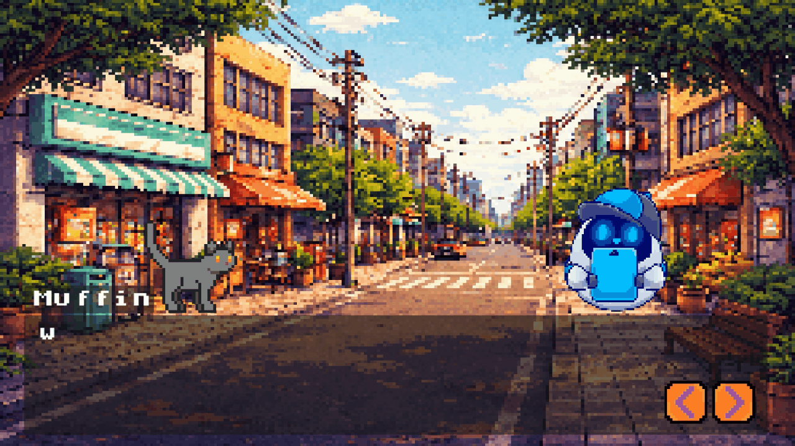
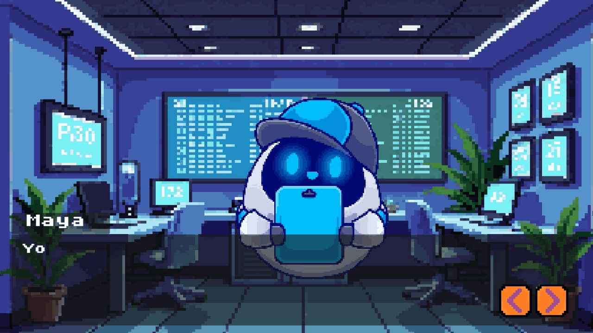
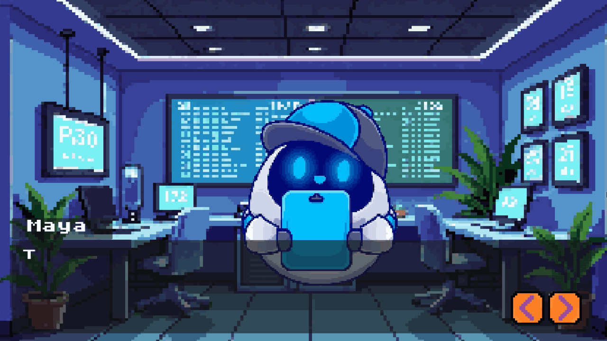

# CyberFriends

An educational game about cybersecurity for younger audiences, developed in Godot Engine.

## Overview
CyberFriends is an interactive visual novel designed to teach basic cybersecurity concepts through story-driven gameplay and dialogue.

## Features
- Custom dialogue system with branching choices
- Event-driven interaction system
- Character animations and scene transitions
- Full localization support (Russian / English)
- User interaction via UI and input system

## Technical Details
- Developed in Godot Engine using GDScript
- Dialogue system built from scratch
- Localization implemented for multi-language support

## Educational Goal
The project aims to introduce younger users to cybersecurity awareness in an accessible and engaging format.

## Gameplay

